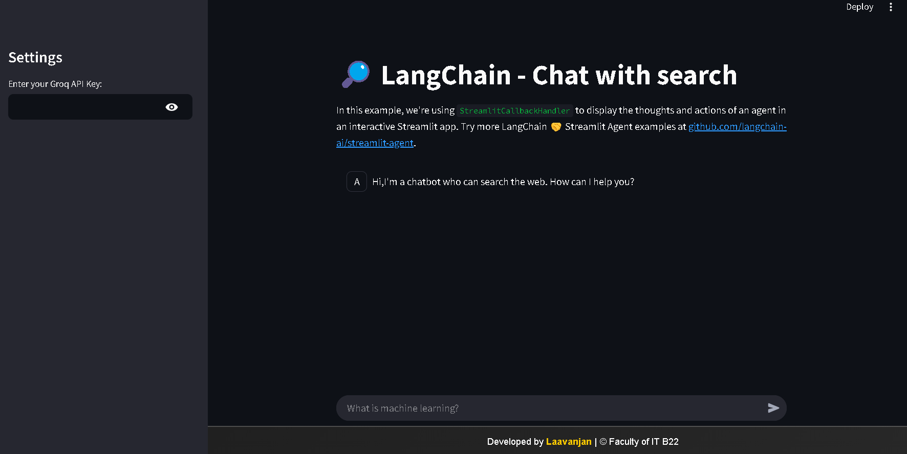
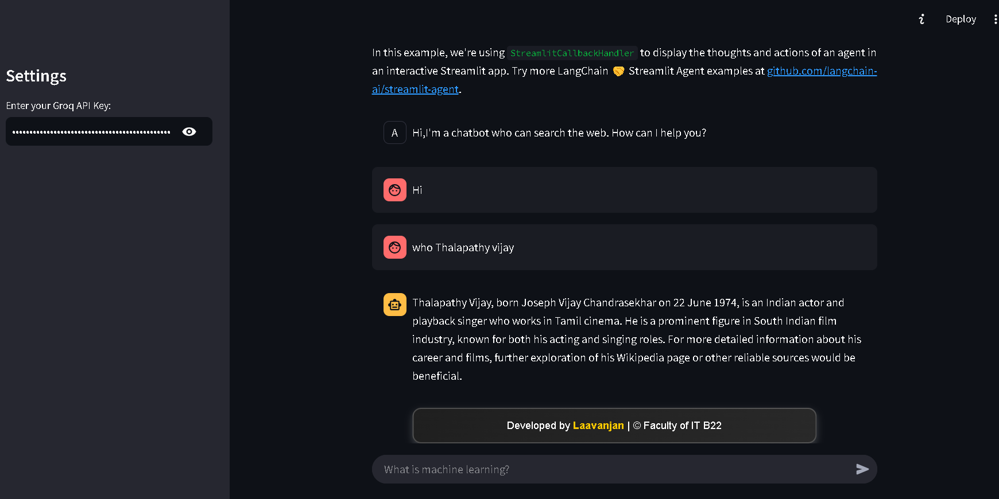
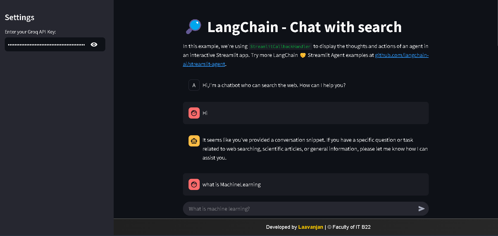
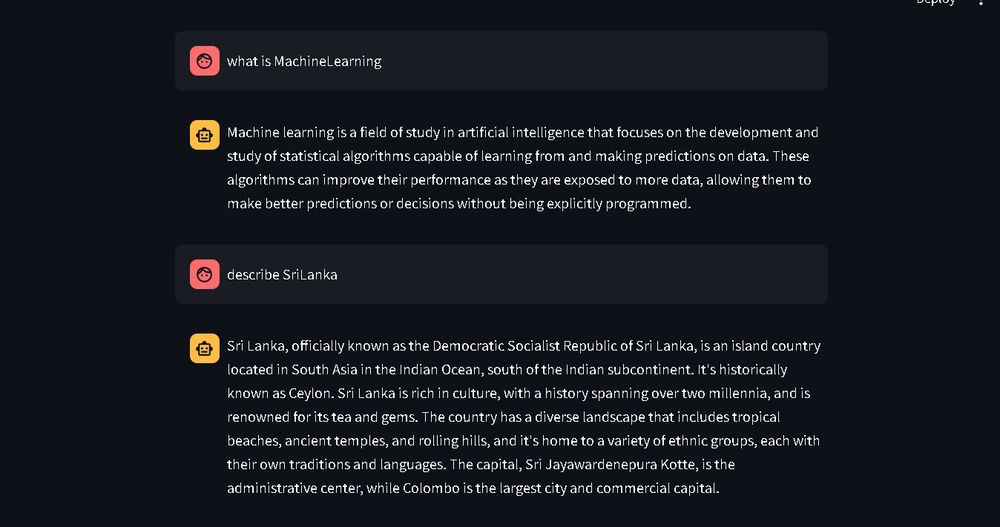
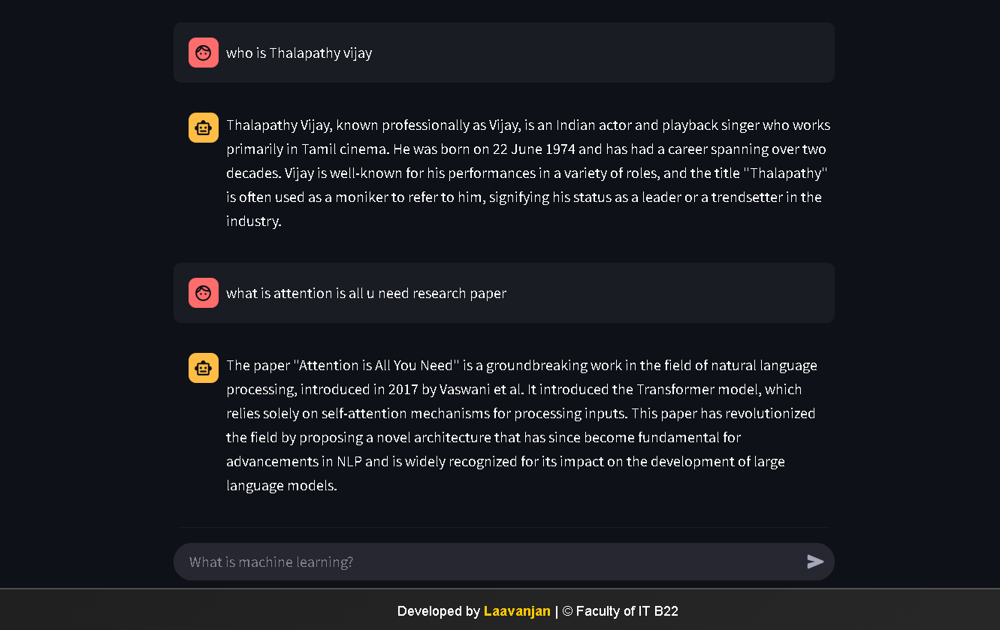
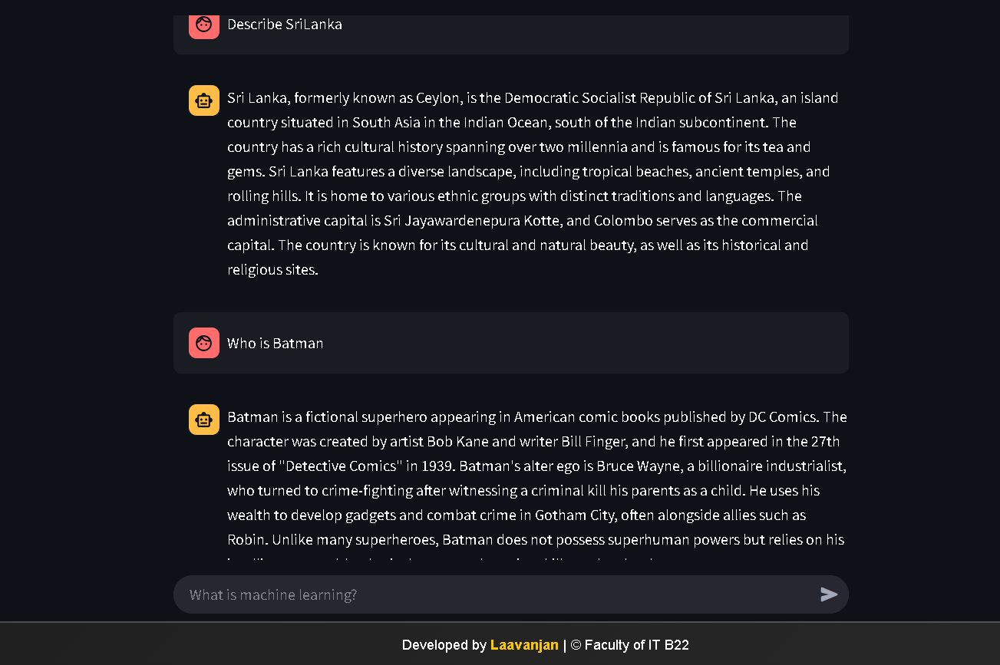
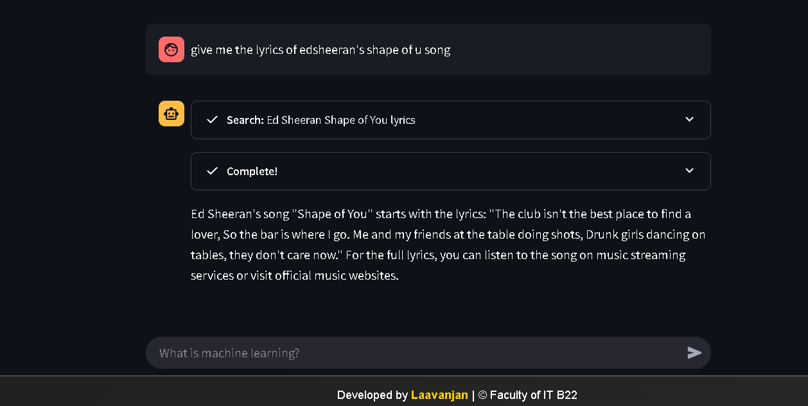

# 🔎 QueryAI: AI-Powered Multi-Source Search Engine
[](https://www.gnu.org/licenses/gpl-3.0)


This project is an AI-powered search engine that leverages open-source LLMs, tools, and agents to provide a comprehensive and interactive search experience. It integrates various search functionalities, including web search, Arxiv, and Wikipedia lookups, offering a unified platform for information retrieval. Built with Streamlit, LangChain, and Groq, QueryAI allows users to query information and receive concise, informative responses generated by a large language model.

## 🖼️ 📸 Example Usage(Questions and their answers, Click to view)

| Who is Thalapathy Vijay? | What is Machine Learning? | Describe SriLanka? |
|---------|---------|---------|
|  |  |  |
| "What is Attention is all u need" question and answer | "Who is Batman" question and answer | Shape Of u Lyrics |
|  |  |  |

## 🚀 Features

* **Interactive Chat Interface:** Engage in a conversational search experience using a Streamlit-powered chat interface. 💬
* **Multi-Source Search:** Access information from multiple sources:
    * **Web Search:** Utilize DuckDuckGo for general web searches. 🌐
    * **Academic Research:** Explore research papers on Arxiv. 📚
    * **Encyclopedic Knowledge:** Retrieve information from Wikipedia. 📖
* **Generative AI Powered:** Leverage the power of open-source LLMs (via Groq) to generate human-like responses and summarize information. 🤖
* **Agent-Based Architecture:** Utilize LangChain agents to orchestrate the search process and interact with different tools effectively. ⚙️
* **Real-time Streaming Responses:** Experience a dynamic search process with streaming responses from the LLM, enhancing interactivity. ⏳
* **LangSmith Integration (Optional):** Track and analyze LangChain runs for debugging and performance optimization. 📈
* **Customizable Settings:** Easily configure the application with your Groq API key. 🔑
* **Open Source and GPL Licensed:** Freely use, modify, and distribute the code under the GPL license. 🧑‍💻

## 📚 Technologies Used

* **Python:** The core programming language.
* **Streamlit:** For building the interactive web application.
* **LangChain:** For agent management and tool integration.
* **Groq:** For accessing the open-source LLM.
* **DuckDuckGo Search:** For web search functionality.
* **Arxiv API:** For accessing academic research papers.
* **Wikipedia API:** For retrieving information from Wikipedia.
* **LangSmith (Optional):** For tracing and debugging LangChain runs.


## 🛠️ Installation

1. **Clone the repository:**

```bash
git clone [https://github.com/laavanjan/Search-Engine-GEN-AI-App.git](https://github.com/laavanjan/Search-Engine-GEN-AI-App.git)
cd Search-Engine-GEN-AI-App
```

2. **Create a virtual environment (recommended):**

```bash
python3 -m venv venv
source venv/bin/activate  # On Linux/macOS
venv\Scripts\activate  # On Windows
```

3. **Install the required packages:**

```bash
pip install -r requirements.txt
```

4. **Set up environment variables:**

* Create a `.env` file in the root directory.
* Add your API key and project name:

```
LANGCHAIN_API_KEY="YOUR_LANGCHAIN_API_KEY"
LANGCHAIN_TRACING_V2="true"
LANGCHAIN_PROJECT="YOUR_LANGCHAIN_PROJECT_NAME"
```

5. **Run the Streamlit application:**

```bash
streamlit run app.py
```

## ⚙️ Usage

1. Open the Streamlit application in your web browser.
2. Enter your Groq API key in the sidebar.
3. Start chatting with the search engine by typing your queries in the chat input.
4. The application will use the agent to query the appropriate tools and generate a response based on the search results.


## 🤝 Contributing

Contributions are welcome! Feel free to open issues and submit pull requests.

## 📄 License

This project is licensed under the GPL v3 License - see the [LICENSE](LICENSE) file for details.

